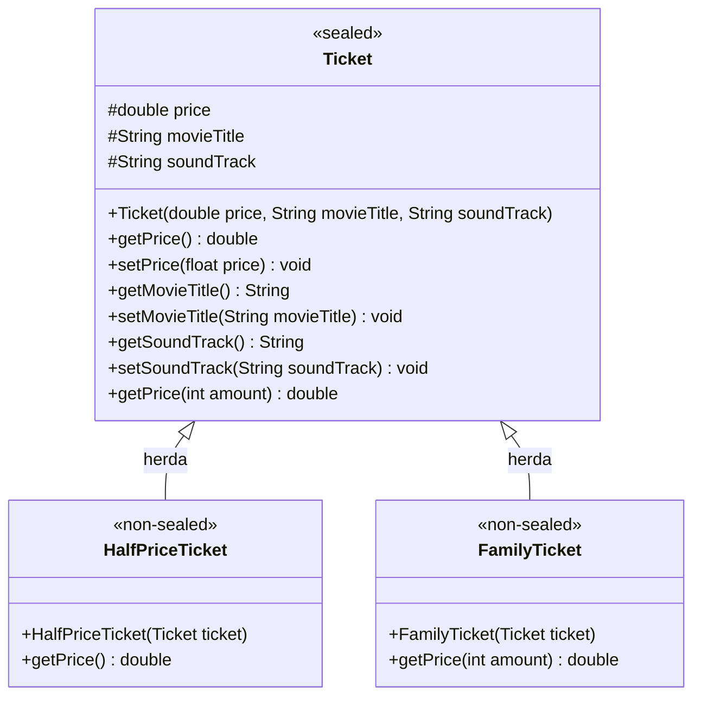

<div align="center">

# 🎬 Cinema Ticket System

> Um sistema intuitivo em Java para gerenciamento e cálculo de bilhetes de cinema, explorando conceitos avançados de Orientação a Objetos e recursos modernos do Java.

[](https://www.oracle.com/java/)
[](https://en.wikipedia.org/wiki/Object-oriented_programming)
[](LICENSE)
[](#)

[Sobre o Projeto](#-sobre-o-projeto) •
[Funcionalidades](#-funcionalidades) •
[Regras de Negócio](#-regras-de-neg%C3%B3cio) •
[Estrutura & Arquitetura](#-estrutura--arquitetura) •
[Como Executar](#-como-executar) •
[Tecnologias Utilizadas](#-tecnologias-utilizadas)

---

</div>

## 📌 Sobre o Projeto

O **Cinema Ticket System** é uma aplicação de linha de comando (CLI) desenvolvida em **Java**, que simula um ponto de autoatendimento ou bilheteria de cinema. O sistema exibe as informações da sessão em cartaz (filme, áudio e preço base) e permite consultar os valores de diferentes modalidades de ingressos com base na quantidade solicitada e benefícios aplicáveis.

---

## ✨ Funcionalidades

- 🎟️ **Exibição Dinâmica da Sessão**: Mostra o título do filme, tipo de áudio e o valor base da entrada.
- 💵 **Ingresso Inteira**: Exibe o preço integral padrão do ingresso.
- 🎓 **Meia-Entrada**: Calcula e aplica automaticamente 50% de desconto sobre o valor unitário.
- 👨‍👩‍👧‍👦 **Ingresso Família**: Permite a compra de múltiplos ingressos com desconto progressivo para compras em grupo (> 2 ingressos).
- 🔄 **Menu Interativo**: Loop interativo no terminal via console para consultas contínuas até a saída pelo usuário.

---

## 📐 Regras de Negócio

| Tipo de Ingresso | Condição | Cálculo / Desconto | Exemplo (Base: R$ 36,00) |
| :--- | :--- | :--- | :--- |
| **Inteira (`Ticket`)** | Padrão (Unitário ou Múltiplo) | `Preço Base * Quantidade` | 1 ingresso = **R$ 36,00** |
| **Meia (`HalfPriceTicket`)** | Estudantes, idosos, etc. | `50%` de desconto (`Preço / 2`) | 1 ingresso = **R$ 18,00** |
| **Família (`FamilyTicket`)** | $\le$ 2 ingressos | Preço normal (`Preço * Quantidade`) | 2 ingressos = **R$ 72,00** |
| **Família (`FamilyTicket`)** | $>$ 2 ingressos | `5%` de desconto sobre o valor total | 3 ingressos = **R$ 102,60** *(ao invés de R$ 108,00)* |

---

## 🏛️ Estrutura & Arquitetura

O projeto adota boas práticas de modelagem orientada a objetos (POO), herança e polimorfismo, destacando o uso do recurso de **Sealed Classes** (classes seladas) do Java moderno para restringir a hierarquia de tipos de ingressos.

### Diagrama de Classes



### Estrutura de Pastas

```text
cinema-ticket-system/
├── src/
│   ├── Main.java               # Ponto de entrada (CLI & interação com o usuário)
│   ├── Ticket.java             # Classe base selada (sealed class)
│   ├── HalfPriceTicket.java    # Especialização para meia-entrada
│   └── FamilyTicket.java       # Especialização com desconto família
├── .gitignore
├── cinema-ticket-system.iml
└── README.md
```

---

## 💻 Exemplo de Execução

Ao rodar a aplicação, o usuário se depara com a seguinte interface no terminal:

```text
=================================
Filme: De volta para o futuro
Audio: Dublado
Preço Inteira: R$ 36.0
=================================
Digite a opção do ingresso: 
1 - Inteira
2 - Meia Entrada
3 - Familia 
0 - Sair
```

### Exemplos de Saída:
- **Opção 1**: `Preço: R$ 36.0`
- **Opção 2**: `Meia Entrada: R$ 18.0`
- **Opção 3** (3 ingressos):
  ```text
  Quantidade de ingresso:  
  3
  Familia: R$ 102.6
  ```

---

## 🚀 Como Executar

### Pré-requisitos
- **Java JDK 17** ou superior instalado ([Download JDK](https://www.oracle.com/java/technologies/downloads/))
- Git configurado em sua máquina

### Passo a Passo

1. **Clone o repositório:**
   ```bash
   git clone https://github.com/Hudson390/cinema-ticket-system.git
   cd cinema-ticket-system
   ```

2. **Compile as classes:**
   ```bash
   javac -d out src/*.java
   ```

3. **Execute o programa:**
   ```bash
   java -cp out Main
   ```

> 💡 **Dica**: Você também pode abrir a pasta diretamente no **IntelliJ IDEA**, **Eclipse** ou **VS Code** e executar o arquivo `Main.java` com um clique.

---

## 🛠️ Tecnologias Utilizadas

- **[Java 17+](https://docs.oracle.com/en/java/)**:
  - `sealed` / `permits` / `non-sealed`: Restrição explícita de especializações de classes.
  - `Enhanced switch` (`->`): Sintaxe moderna e limpa de blocos de decisão.
  - Inferência de tipo local (`var`).
- **Git**: Controle de versão.

---

## 👤 Autor

Desenvolvido por **Hudson**.  
Sinta-se à vontade para conectar-se ou contribuir!

[](https://github.com/Hudson390)
